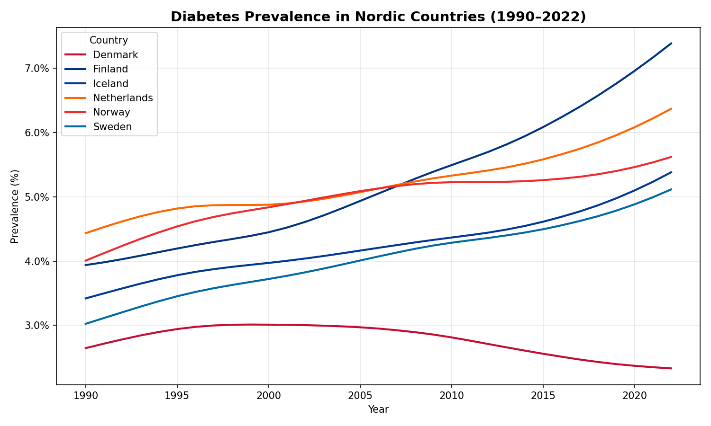
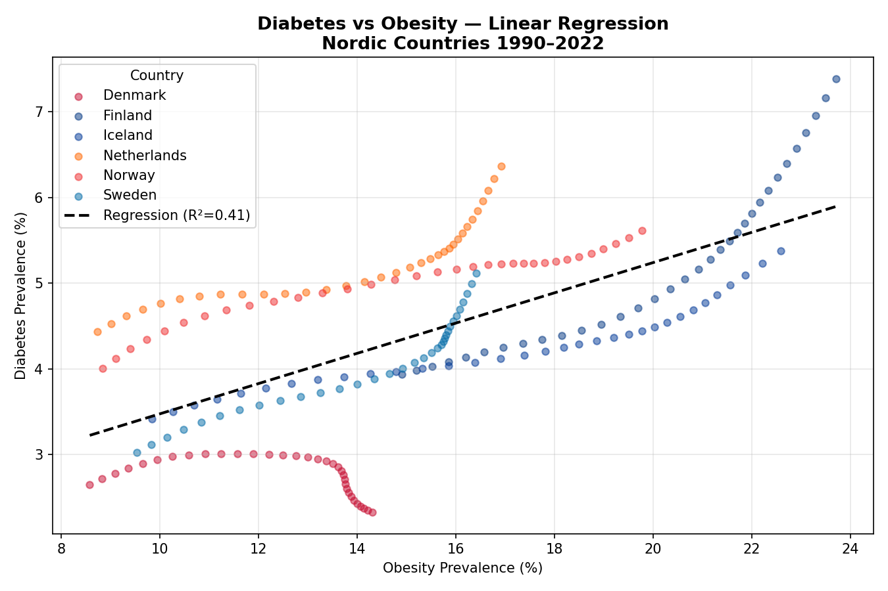
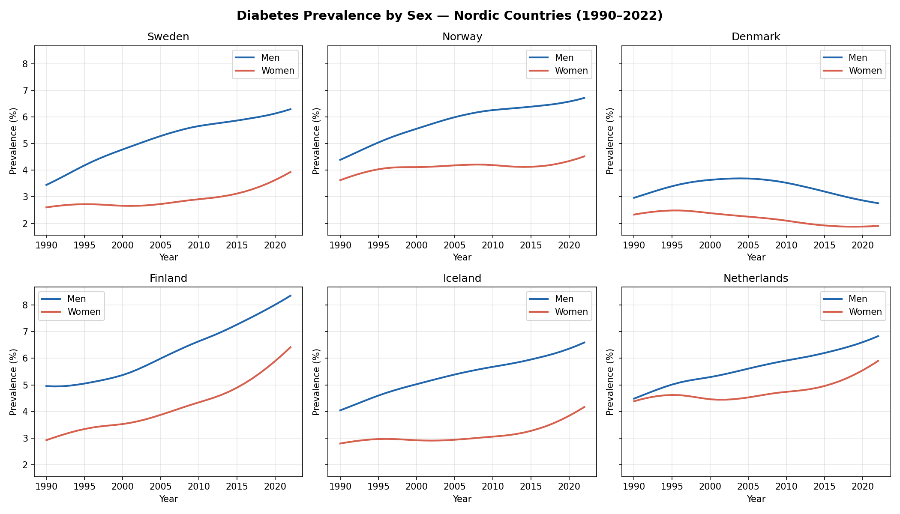

# Nordic Chronic Disease Analysis

Analysis of diabetes prevalence trends across Nordic countries (1990–2022), 
using NCD-RisC and Our World in Data public health datasets.

## Research Questions
1. How has diabetes prevalence changed across Nordic countries from 1990 to 2022?
2. What is the relationship between obesity and diabetes prevalence?
3. Are there gender differences in diabetes trends?
4. What can Denmark's declining trend tell us about effective public health policy?

## Data Sources
- **NCD-RisC** (2024): Diabetes prevalence by country, age-standardised, 1990–2022  
  *Lancet 2024 — pooled analysis of 1108 population-representative studies*
- **Our World in Data / WHO**: Obesity prevalence (BMI ≥ 30), 1990–2016

## Project Structure

    nordic-chronic-disease-analysis/
    ├── data/
    │   ├── diabetes.csv           # Raw NCD-RisC diabetes data
    │   ├── obesity.csv            # Raw OWID obesity data
    │   └── nordic_cleaned.csv     # Cleaned & merged dataset
    ├── notebooks/
    │   ├── 01_data_exploration.ipynb
    │   ├── 02_data_cleaning.ipynb
    │   ├── 03_visualization.ipynb
    │   └── 04_regression.ipynb
    ├── figures/
    │   ├── diabetes_trend.png
    │   ├── diabetes_vs_obesity.png
    │   ├── diabetes_by_sex.png
    │   └── regression.png
    └── README.md

## Key Findings

### 1. Universal upward trend — except Denmark
All Nordic countries show rising diabetes prevalence from 1990 to 2022. 
Denmark is the only exception, with prevalence peaking around 2005 and 
declining steadily since.


### 2. Obesity is a significant but incomplete predictor
Linear regression across all countries shows R²=0.41 (p<0.001): obesity 
explains 41% of diabetes variation. Country-level R² ranges from 0.87 
(Finland) to 0.23 (Denmark), suggesting other factors — including policy 
interventions — play a substantial role.


### 3. Gender gap is consistent across all countries
Men consistently show higher diabetes prevalence than women in all six 
countries. Finland shows the widest and growing gender gap.


### 4. Denmark's negative slope: a policy signal
Denmark is the only country with a negative obesity-diabetes slope (−0.06, 
p=0.005), meaning diabetes prevalence fell even as obesity rose. This 
coincides with Denmark's introduction of fat and sugar taxes in the early 
2010s, suggesting that fiscal health policy may decouple obesity from 
diabetes outcomes.

## Tools & Methods
- Python 3, pandas, matplotlib, scipy
- Linear regression (OLS) per country and pooled
- Age-standardised prevalence estimates throughout

## How to Run
```bash
git clone https://github.com/SiqiHsiang/nordic-chronic-disease-analysis.git
cd nordic-chronic-disease-analysis
python3 -m venv venv
source venv/bin/activate
pip install pandas matplotlib scipy
jupyter notebook
```
